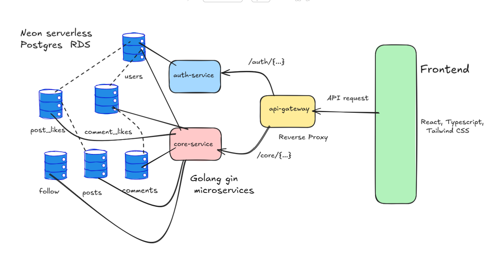
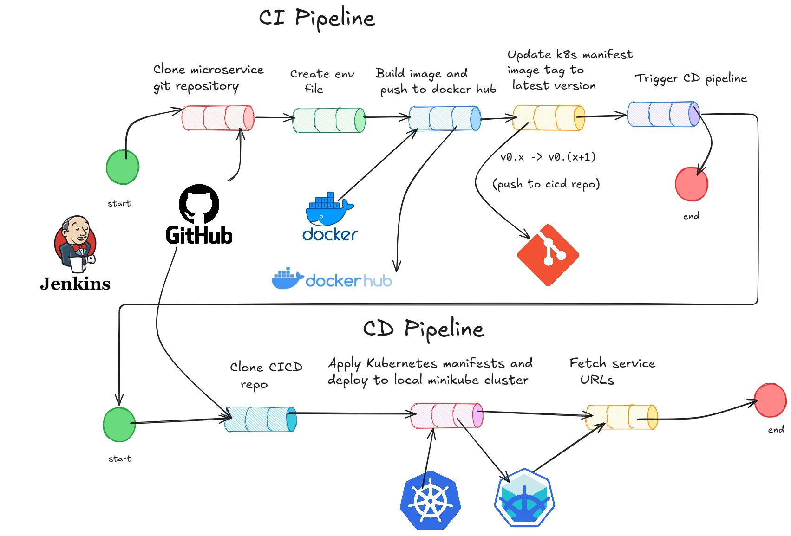
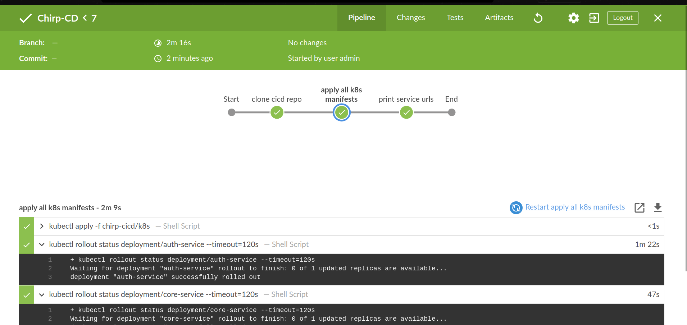
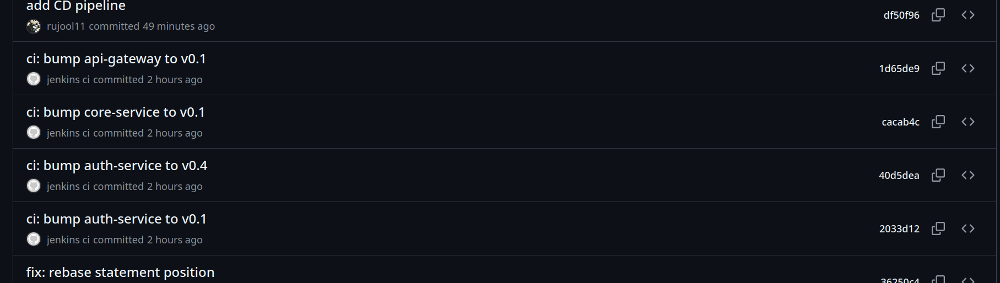
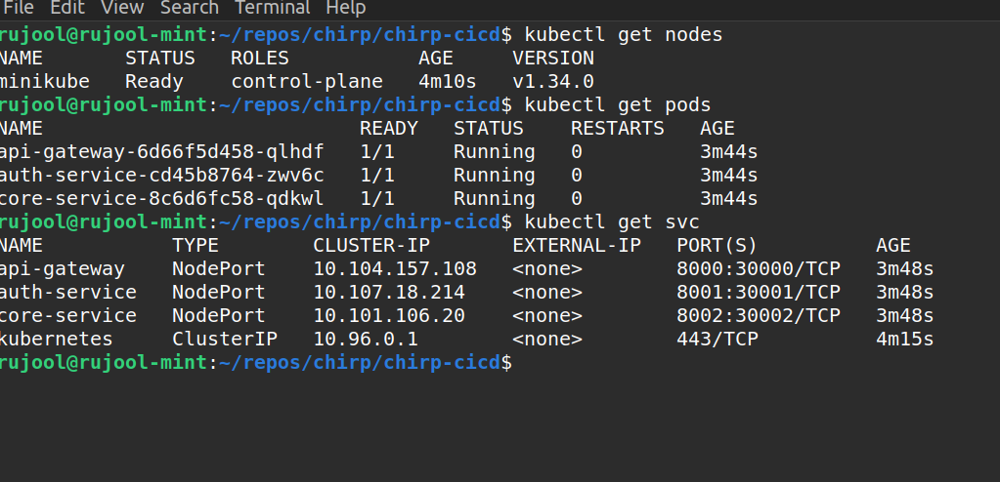
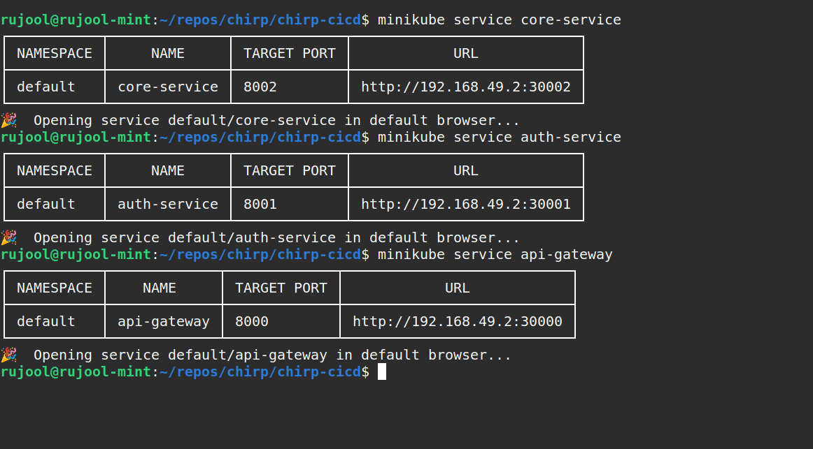

# Chirp — Microservices-based Social Media Platform


## 📘 Overview

**Chirp** is a microservices-based modern social media application built stack.  
It is designed for scalability, modularity, and clean separation of concerns — with individual services for authentication, core social interactions, and reverse proxy API gateway that bridges the backend with the frontend.

Allows users to register, create posts, comment, like, follow other users and interact with others, while maintaining a flexible architecture that supports independent development and deployment of each component.

---

## ⚙️ Tech Stack

| Layer | Technology | Description |
|-------|-------------|-------------|
| **Frontend** | React, TypeScript, Vite, Tailwind CSS | User interface for the Chirp app |
| **Backend** | Go (Gin ) | REST APIs built as independent microservices |
| **Database** | PostgreSQL (NeonDB) | Neon serverless cloud-hosted relational database |
| **API Gateway** | Go (Gin Reverse Proxy) | Routes requests between frontend and backend so only single endpoint needs to be exposed to frontend |
| **CI/CD** | Jenkins, Docker, Kubernetes | Continuous integration and deployment pipelines on local minikube cluster |

---

## 🧩 Repositories

| Repository | Description |
|-------------|-------------|
| **chirp-auth-service** | Handles user authentication, registration, updation, and JWT-based authorization |
| **chirp-core-service** | Core features — posts, likes, comments, and follow |
| **chirp-api-gateway** | Reverse proxy that connects frontend and backend |
| **chirp-frontend** (wip) | React, TypeScript and Tailwind CSS frontend interface |
| **chirp-cicd** | CI/CD setup with Jenkins pipelines and k8s manifests |

---

## 🏗️ System Architecture

Chirp follows a **microservices-based architecture** built with a clear separation of concerns between frontend, gateway, backend services, and database.

### 🔹 Overview

- The frontend application sends API requests to a single **API Gateway**.  
- The **API Gateway** acts as a **reverse proxy**, routing requests to the appropriate backend microservice.  
- The backend consists of **chirp-auth-service** and **chirp-core-service**, each handling a distinct domain (authentication, core social features).  
- Using **Neon Serverless PostgreSQL (Cloud Database)** for persistent data storage, availability and scalability.
---

### Components

#### **API Gateway**
- Serves as a **reverse proxy** between the frontend and backend  
- Routes requests based on path prefixes:  
  - `/auth/{...}` → **Auth Service**  
  - `/core/{...}` → **Core Service**

#### **Auth Service**
- Responsible for **user registration**, **authentication**, and **JWT management**  
- Interacts primarily with the `users` table in the database

#### **Core Service**
- Manages core social features — posts, comments, likes, following. 
- Interacts with the following tables:
  - `posts`  
  - `comments`  
  - `post_likes`  
  - `comment_likes`  
  - `follow`

---

### 🔄 Request Flow

1. The **frontend** sends an API request to the **API Gateway**.  
2. The **gateway** forwards the request to the corresponding backend service (`auth` or `core`).  
3. The **service** interacts with the **Neon PostgreSQL** database as needed.  
4. The response flows back through the **gateway** to the **frontend**.

---

### 🗺️ Architecture Diagram




## 🗄️ Database Design

The **Chirp** backend uses a **PostgreSQL (Neon Serverless)** database to manage user data, posts, and social interactions efficiently.  

- **Users** — Stores core profile data and user statistics (followers, following, likes, posts).  
- **Posts** — Represents individual posts made by users, tracking likes and comment counts.  
- **Comments** — Handles user comments on posts, linked to both users and posts.  
- **PostLikes** — Maps users to posts they have liked (many-to-many relationship).  
- **CommentLikes** — Maps users to comments they have liked.  
- **Follow** — Tracks the follower/following relationships between users.

All foreign key constraints use **`ON DELETE CASCADE`** to ensure dependent records are automatically removed when a parent entity is deleted.

### ER Diagram

```mermaid
erDiagram
    USERS {
        INT id PK
        VARCHAR(50) username UNIQUE
        VARCHAR(50) email UNIQUE
        VARCHAR(255) password_hash
        TEXT bio
        INT likes_count
        INT followers_count
        INT following_count
        INT tweets_count
        TIMESTAMP created_at
    }

    POSTS {
        INT id PK
        INT user_id FK
        TEXT content
        INT likes_count
        INT comments_count
        TIMESTAMP created_at
    }

    COMMENTS {
        INT id PK
        INT post_id FK
        INT user_id
        TEXT content
        INT likes_count
        TIMESTAMP created_at
    }

    POST_LIKES {
        INT user_id FK
        INT post_id FK
        TIMESTAMP created_at
    }

    COMMENT_LIKES {
        INT user_id
        INT comment_id FK
        TIMESTAMP created_at
    }

    FOLLOW {
        INT follower_id FK
        INT following_id FK
        TIMESTAMP created_at
    }

    %% Relationships
    USERS ||--o{ POSTS : "creates"
    USERS ||--o{ COMMENTS : "writes"
    USERS ||--o{ POST_LIKES : "likes"
    USERS ||--o{ COMMENT_LIKES : "likes"
    USERS ||--o{ FOLLOW : "follows"
    POSTS ||--o{ COMMENTS : "has"
    POSTS ||--o{ POST_LIKES : "liked by"
    COMMENTS ||--o{ COMMENT_LIKES : "liked by"
    FOLLOW }o--|| USERS : "is followed by"
  ```

## ⚙️ CI/CD Strategy

The **Chirp** project uses a robust Jenkins-based CI/CD pipeline to automate builds, Docker image pushes, and Kubernetes deployments. The setup ensures consistent, versioned deployments across all microservices.

---

### 🧩 Overview

| Stage | Pipeline | Description |
|-------|-----------|--------------|
| 🏗️ **CI (Continuous Integration)** | `Chirp-CI` | Builds Docker images for microservices and pushes them to DockerHub. Updates K8s manifests in the `chirp-cicd` repo. |
| 🚀 **CD (Continuous Deployment)** | `Chirp-CD` | Deploys updated manifests to Minikube using `kubectl`. Verifies rollout success and prints service endpoints. |

---

### 🧱 CI Pipeline (Build and Push)

The CI pipeline (`Chirp-CI`) is defined in Jenkins.

#### Key Stages:
1. **Clone Microservice Repo**
   - Dynamically clones the specified microservice repo from GitHub.

2. **Inject Environment Variables**
   - Writes `.env` file inside each microservice based on Jenkins credentials:

3. **Build and Push Docker Image**
   - Extracts the current image version from the `chirp-cicd/k8s` manifest.
   - Increments version tag (`v0.x`) automatically.
   - Builds Docker image and pushes to DockerHub:  
     `rujool11/<service-name>:v0.x`

4. **Update K8s Manifest**
   - Updates the image tag in the service’s Kubernetes deployment YAML so that CD pipeline always deploys latest image.
   - Commits and pushes the updated manifest to the `chirp-cicd` repo.

5. **Trigger CD Pipeline**
   - Automatically triggers the `Chirp-CD` pipeline with new version info.

#### 🧠 Parameters
| Parameter | Description |
|------------|-------------|
| `SERVICE_REPO` | Git URL of microservice (e.g., `https://github.com/rujool11/chirp-auth-service.git`) |
| `SERVICE_NAME` | One of `auth-service`, `core-service`, or `api-gateway` |

---

### ☸️ CD Pipeline (Deploy to Kubernetes)

The CD pipeline (`Chirp-CD`) handles deployment of all services inside local **Minikube**.

#### Key Stages:
1. **Clone CICD Repo**
   - Clones the latest `chirp-cicd` repo from GitHub.

2. **Apply Kubernetes Manifests**
   - Runs `kubectl apply -f k8s/` to apply all manifests.
   - Waits for each deployment to successfully roll out:
     - `auth-service`
     - `core-service`
     - `api-gateway`

3. **Expose Services**
   - Retrieves the Minikube IP.
   - Prints accessible service URLs:
     ```
     auth-service -> http://<minikube-ip>:30001
     core-service -> http://<minikube-ip>:30002
     api-gateway -> http://<minikube-ip>:30000
     ```

---

### 🐳 Jenkins Setup Script

A `run-jenkins.sh` script is provided to spin up Jenkins with Docker and Kubernetes access preconfigured, and provides an easy way to quickly set up Jenkins for this project.

### CI/CD Flow 


### 🧩 Continuous Integration Pipeline 


### 🚀 Continuous Deployment Pipeline


### 🏷️ Versioning Commits


### ☸️ Minikube Services & Exposed Endpoints
 Kubernetes Deployment (kubectl apply)


### ☸️ Minikube Services & Exposed Endpoints

